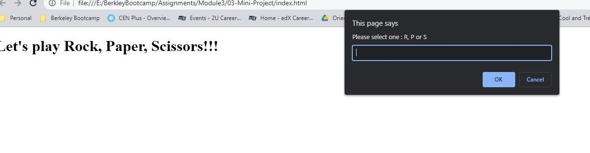

# Rock, Paper, Scissors Game

A game application which allows user to play Rock, Paper and Scissors game with an automated opponent and keeps track of their wins, ties and losses.

## Decription

The game has following features:

1. The user can enter R, P, or S in prompt to signify their choice of rock, paper, or scissors.

2. The computer randomly choose R, P, or S in return.

3. The user has an option to play again whether they win or lose.

4. The user can see their total wins, ties, and losses after each round.

## Mock Up

Demo of the project:

## Usage
You can access:
1. the file in GitHub repository: https://github.com/rbhumbla1/RPS-Game
2. the application using this URL: https://rbhumbla1.github.io/RPS-Game

## License
None